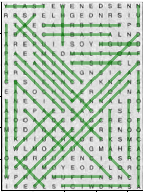

# COM2004/3004 Assignment

## Developing and Evaluating a Word Search Puzzle Solver

*Due*: 3:00pm on Tuesday 13th December

## Contents

<!-- TOC depthFrom:1 orderedList:false -->

- [1. Objective](#1-objective)
- [2. Background](#2-background)
- [3. What you are given](#3-what-you-are-given)
- [4. How to proceed](#4-how-to-proceed)
- [5. Additional rules](#5-additional-rules)
- [6. Submission](#6-submission)
- [7. How your work will be assessed](#7-how-your-work-will-be-assessed)
- [8. Lateness penalty](#8-lateness-penalty)

<!-- /TOC -->

## 1. Objective

You are asked to build and evaluate a system that can solve Word Search puzzles. The input to the system will be, i) a set of images of Word Search puzzles photographed from a puzzle book and stored in `png` image format, ii) the list of words that are to be found in each puzzle. The output will be a sequence of word positions indicating the grid coordinates of the first and last letter of each of the words that are to be found. Solving the problem will require two stages: building a letter classifier; implementing a word finding algorithm. Your classifier must operate with feature vectors that have no more than 20 dimensions. You are given labelled data sets for training and evaluation, and some template code to help you get started.

## 2. Background

A Word Search is a puzzle game that first appeared in the 1960's (see [Wikipedia](https://en.wikipedia.org/wiki/Word_search)) and which is now commonly found in newspapers and puzzle books. The puzzle consists of a grid of letters and a list of words that are hidden in the grid. Words appear in the grid as straight, connected sequences of letters which can run in any direction, i.e., including diagonally and backwards.  The aim is for the solver to locate each of the words.

In the lab classes, you have been experimenting with techniques for classification and dimensionality reduction. In this assignment, you will use the experience you have gained to build a system for solving Word Search puzzles, i.e., taking images of word search puzzles and outputting the positions of the hidden words. This involves taking the image of the full puzzle, cutting it into separate squares (i.e., one square for each letter) and then classifying the letter images, i.e., as one of the 26 possible letters, `A' to `Z'. Finally, you will need an algorithm to search through the grid of labels to find where the words are hidden. In Word Search puzzles, the words can run left, right, up, down, or in any diagonal direction. Words can also overlap.

The images you will be processing have come from a normal puzzle book, the 'Tesco Handy Mixed Puzzle' book and have been photograph using an iPhone. To make the task more interesting, photographs of varying quality have been captured: high-quality in which the letter are clearly readable (see Figure 1); and low-quality where the blurring of the image makes many letters quite ambiguous (see Figure 2).

You are provided with a correctly-labeled set of training data and if you use appropriate techniques you should be able to produce a solution that will work perfectly on the high-quality data, and surprisingly well on the low-quality data. You will be assessed partly on the performance of your solution.

{ width=250px }

{ width=250px }

## 3. What you are given

You have been given,

1. data for training and testing your systems, and
2. some template code to get you started.

The template code will run but it will produce poor results. The dimensionality reduction, classification and word searching stages have been given stub implementations: they return the correct type of value but do nothing useful. You will need to replace these implementations using ideas that you have learnt during the course.

### 3.1. The data

There are two types of data.

1. *Image files*. These are `png` images of complete puzzles. The images have all be pre-processed so that are all upright and scaled such that each letter in the image occupies a 30 by 30 pixel square.
2. *Label files*. There are two label files: `puzzles.train.json` which provides labels for the training data, and `puzzles.dev.json` which provides labels for the development test data. They are stored in JSON format and contain a list of dictionaries. Each dictionary represents one puzzles and has the structure shown below,

```json
 {
    "name": "WS22",
    "rows": 20,
    "columns": 15,
    "words": ["bagel", "baguette", ..., "yeast"],
    "positions": [[11, 2, 15, 6], [1, 1, 8, 8], ..., [0, 0, 0, 4]],
    "letters": [
        "YEASTEWENEDSENN",
        "RBSPELHGEDNRSIU",
        ...
    ]
  },
```

In the dictionary, the fields have the following meaning:

- `name` : a string containing the name of the puzzle - used to identify the image file
- `rows` : an integer specifying the number of rows in the puzzle.
- `columns` : an integer specifying the number of columns in the puzzle.
- `words` : a list of strings containing the words to be found in the puzzle.
- `positions` : a list of 4 digit lists indicating the correct position of each word. The first two digits are the row and column of the first letter, and the last two digits are the row and column of the last letter.
- `letters` : a list of strings containing the letters in the puzzle. The first string is the first row of letters, the second string is the second row of letters, etc.

### 3.2. The code

The code is organised into four Python files: `train.py`, `evaluate.py`, `utils.py` and `system.py`. `train.py` and `evaluate.py` will train and test the system, respectively. They will do this by calling functions in  `system.py`. Your task is to rewrite the code in `system.py` to produce a working system. **No other Python file should be changed.**

In brief, the code files have the following function.

- `train.py` - this runs the training stage. It will train two models: one using the high quality images and one using the low quality images. For each model, `train.py` will read the corresponding training data, process it, and store results. Results are saved in a pair of files called `model.high.json.gz` and `model.low.json.gz` stored in the directory, `data/`, for the high and low quality data respectively. The training code uses functions in `system.py` that you will need to modify and extend. Do not change the code in the `train.py` file itself.

- `evaluate.py` - this runs the evaluation stage. It will run two evaluations: one using the high quality data and one using the low quality data. For each dataset, `evaluate.py` first reads the corresponding model file, i.e., `model.high.json.gz` or `model.low.json.gz`. It will then perform the letter classification on the test images. It will then attempt to find the puzzles list of words in the grid of classified letters. Finally, it will use the test image letter labels and known word locations to evaluate the solution, reporting scores for the percentage of letters correctly classified, and the percentage of words correctly located. Similarly to `train.py`,it uses functions in `system.py` that you will need to modify and extend. Do not change the code in the `evaluate.py` file itself.

- `utils.py` - these are some utility functions that perform operations such as loading and segmenting the image files. Do not change the code in this file.

- `system.py` - the code in this file is used by both `train.py` and `evaluate.py`. It implements the key system functionality, including the dimensionality reduction, the classification, and the word searching steps that you will develop. The provided version contains dummy code that will run but which won't produce good results. The dummy dimensionality reduction just returns the first elements of the feature vector; The dummy classifier outputs the label 'E' for every square; the dummy word finder always says the word lies between square (0, 0) and (1, 1).

Your task is to write a new version of `system.py`. Your solution must not change `train.py`, `evaluate.py` or `utils.py`. Once finished, you will run `train.py` to generate your own versions of `model.high.json.gz` and `model.low.json.gz`. You will then submit the `system.py` along with the `model.high.json.gz` and `model.low.json.gz` files. The assignment assessors will then run the program `evaluate.py` using your copy of `system.py` and your model files. We will evaluate using a new test puzzle images that you have not seen during development. The performance on the unseen test puzzle will form part of the assessment of your work.

## 4. How to proceed

The plan below has been written to help you get started. Steps 1 and 2 should be completed first. Steps 3 to 6 are not necessarily sequential, and you are free to use any process you wish. However, it is recommended that you read through this section carefully before considering how best to proceed.

### Step 1: Read and understand the code provided

The code provided does all the file handling and some of the initial processing steps for you, e.g., segmenting the puzzle image into squares. Spend time to understand how it works before planning your solution.

### Step 2: Test the code provided

Check that you can run the code provided. You can download it to your machine and run it in your local environment, or you can run it directly on CoCalc. If using CoCalc, then open a terminal in CoCalc and then navigate to the directory containing the assignment code,

```cd assignment/code```

Run the train step

```python3 train.py```

Then run the evaluation step

```python3 evaluate.py```

The code should print out the percentage of correctly classified letters and the correctly located words for both the high quality and low quality image conditions. The dummy code will produce the same result for both conditions: 10.7\% letters classified correctly and 0.0\% words found correctly.

The `evaluate.py` function can also be asked to produce an image showing where the words are. To do this you need to add the argument `--display` to the command line. For example,

```python3 evaluate.py --display```

For a working solution, this will produce an output something like that shown in Figure 3 on the next page.

{ width=250px }

### Step 3: Working on the training stage

The function `process_training_data` in `system.py` processes the training data and returns results in a dictionary called `model_data`. The program `train.py` calls `process_training_data` and saves the resulting `model_data` dictionary to the files `model.high.json.gz` and `model.low.json.gz`. These files are then used by the classifier when `evaluate.py` is called. So, any data that your classifier needs must go into this dictionary. For example, if you are using a nearest neighbour classifier then the dictionary must contain the feature vectors and labels for the complete training set. If you are using a parametric classifier then the dictionary must contain the classifier's parameters. The function is currently written with a nearest neighbour classifier in mind. Read it carefully and understand how to adapt it for your chosen approach.

### Step 4: Implementing dimensionality reduction

You are free to use any dimensionality reduction technique. PCA should perform well but is not necessarily the best approach. Start by looking at the function `reduce_dimensions` in the existing `system.py` code provided. This function currently just returns the first 10 pixels of each image and will not work well. It will need to be rewritten.

### Step 5: Implementing the classifier

You are free to use any classification technique. A nearest neighbor classifier should work well but is not necessarily the best approach. Start by looking at the functions `classify_squares` in the `system.py` code provided.  Note, it is passed the features vectors for all the letter images that need to be classified, and the dictionary containing the parameters of the classifier that was trained when `train.py` was run. The function should return a list of labels, one for each input feature vector.  The function currently just returns the label ('E') regardless of the input. It will need to rewritten.

### Step 6: Implementing the word search

The word search stage is implemented by the function `find_words()` in `system.py`. It takes a grid of letter labels stored as a 2D numpy array, and a list of word strings that need to be found.  The function needs to take each word in the list of words and find its position in the grid of classified letters. It needs to return a list of 4-digit tuples, i.e., one for each word with the format, `(start_row, start_col, end_row, end_col)`.

You will need to make sure that the search checks all possible directions that the word could be in. The challenge with this stage is that the grid of classified letters may (and generally will) contain errors. If there are errors then you may not find an exact match for the word, but will need to consider how to make the best guess about where it belongs.

This function can get quite complicated, so take care to implement and document it carefully, for example, by breaking it down into a number fo smaller functions as appropriate.
## 5. Additional rules

Some additional important rules must be obeyed. **Read these carefully**.

- Your feature vectors must have no more the 20 dimensions.
- The files `model.high.json.gz` and `model.low.json.gz` must each be no bigger than 3 MB each.
- The `evaluate.py` program should not take more than 120 seconds to produce a result when it runs on the CoCalc servers.
- You may make use of any code from the lab classes, even code appearing in the solutions (but you may want to improve it!) If using code from the labs, you must acknowledge the source of any code you didn't write yourself.
- Python modules: You may only import `numpy`, `scipy`, or modules in the Python standard library. For a list of modules in the standard library see [http://docs.Python.org/3/library/](http://docs.Python.org/3/library/). If in doubt, please ask.
- 3rd party source code: With the exception of code from the labs, you should not be using source code from 3rd parties. If you do use code that is not your own **you must** provide **clear** attribution, i.e., place it in a separate function with a comment that provides the URL of the original code. Failure to do so may be considered a case of Unfair Means.

## 6. Submission

Submission will be via Blackboard. You must submit the following.

- A copy of your `system.py`
- A copy of your data file, `model.high.json.gz`
- A copy of your data file, `model.low.json.gz`
- A form (which will appear on Blackboard) in which you will:
  - report the performance of your system on the development set;
  - explain/justify the design of your feature selection;
  - explain/justify the design of the letter classifier;
  - explain/justify the design of the word search algorithm.

**Deadline: 3:00 pm on Tuesday, December 14th.**

## 7. How your work will be assessed

**The assignment is worth 50% of the module mark.**

We will be looking at the Python code quality, the overall design and the performance of your program. Assessors will be looking at your reports, so make sure to describe your work clearly. You will be awarded a mark out of 50, broken down into the following five 10-mark components.

### Feature extraction (10 Marks)

The stage that produces 20-dimensional feature vectors that are input into the classifier.

*Assessed via the written report and evidence of implementation in the code.*

- Have you employed an appropriate feature extraction technique?
- Have you justified the choice and design of the feature extraction stage?
- Have you implemented the chosen technique well?

### Letter Classification (10 Marks)

The stage that takes a feature vector and returns a letter label.

*Assessed via the written report and evidence of implementation in the code.*

- Have you employed an appropriate classification technique?
- Have you justified the choice and design of the classifier?
- Have you implemented the chosen technique well?

### Word Search (10 Marks)

The stage that analyses the classifier output to find where the words occur in the grid.

*Assessed via the written report and evidence of implementation in the code.*

- Have you designed an efficient and robust approach?
- Is the approach clearly implemented?
- Does the approach work well?

### Code quality (10 Marks)

*Assessed via examination of the code.*

- Is the implementation clear? (i.e., concise and simple, compared to verbose and unnecessarily complicated).
- Is there good documentation within the code? (i.e., consistent documentation of functions and comments added where they are required).
- Does it make appropriate use of Python's features?

### Overall performance (10 Marks)

*Assessed by running the code.*

- Does the code run correctly?
- How does the performance compare to that achieved using a standard nearest neighbour and PCA approach?
- How does the performance compare to the performances of other students?

For guidance, the table below shows the approximate performance that you should expect using a basic nearest neighbour and PCA-based approach.

Dataset | %Letter Correct | %Word Correct
--- | --- | ---
High Quality | 99.3% | 100.0% correct
Low Quality | 53.0% | 61.1% correct

## 8. Lateness penalty

There will be a standard 5% penalty for each working day late.

**WARNING: This is an individual assignment. Do not share your code with other students. Collusion will result in a loss of marks for all students involved. Uncredited code taken from Github or other sources will be treated as plagiarism. Anything looking suspicious will be investigated. Start early and if you are stuck ask for help.**

(COM2004/3004 2022-23 Assignment Handout v1.0)
